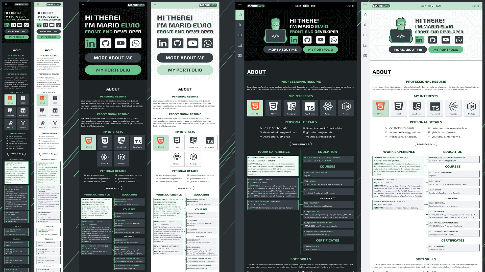

# Mario Elvio Portfolio

 

Summary
=================
<!--ts-->
   * [Project description](#about)
   * [Project Deployment](#demo-project)
   * [Features](#features)
   * [Prerequisites and project installation](#pre-req)
<!--te-->

<h2 id="about">Project Description</h2>
 

> This project is a personal site to talk about myself and publish the projects I developed or worked on. The technologies used for the development of this site were chosen according to the project's need for code reuse, easy maintenance, readability and the entire design was thought for mobile first.

 

### Functionalities:
* coming soon.

 

### Technologies used in development:

* <strong>Figma</strong> - Editor for creating the interface design.
* <strong>PhotoShop</strong> - Software used for image editing.
* <strong>HTML5</strong> - Markup language.
* <strong>React.js</strong> - Library for front-end development.
* <strong>TypeScript</strong> - Programming language used in development.
* <strong>styled-components</strong> - React library used for styling.
* <strong>Node.js</strong> - Server-side development.
* <strong>Mysql</strong> - Database.

<h2 id="demo-project">Project Deployment</h2>

### Interface design with Figma:
<a align="left" href="https://www.figma.com/file/t85caWsRB2xisvnuplY9An/Mario-Elvio?node-id=0%3A1">https://www.figma.com/file/t85caWsRB2xisvnuplY9An/Mario-Elvio?node-id=0%3A1</a>

### Deploy:
<a align="left" href="https://www.marioelvio.com/" target="_blank">https://www.marioelvio.com/</a>

<h2 id="features" align="center">Features</h2>

 

> The project is still in development and the next steps will be updated below:

* [X] Requirements gathering.
* [X] Interface design.
* [X] Svgs adjustments.
#### Front-end:
* [X] Project structure (folders, color palette, fonts and routes).
* [X] Header
* [X] Menu
* [X] Footer
* [ ] Multi-language
* [X] Home page
* [X] About page
* [ ] Portfolio page
* [ ] Blog page
* [ ] Contact page
* [ ] Login page
 AdminPanel:
* [ ] Settings page
* [ ] About page
* [ ] Resume page
* [ ] Personal details page
* [ ] My interests page
* [ ] Work Experience page
* [ ] Education page
* [ ] Certificates page
* [ ] Courses page
* [ ] Soft Skills page
* [ ] Hard Skills page
* [ ] Portfolio list page
* [ ] Edit portfolio page
* [ ] Technologies page

#### Back-end:
> coming soon.

#### Database:
* [ ] Database Modeling
* [ ] Database creation

<h2 id="pre-req">Prerequisites and project installation</h2>

### Public (Front-end):
#### Installation:
#### `npm install`
#### Execution:
#### `npm start`

#### Build:
#### `npm run build`

### Server (Back-end):

> coming soon.

### Database:

> coming soon.

<h2 align="center">Author</h2>

 

Developed by <a href="https://marioelvio.com">Mario Elvio</a>.

