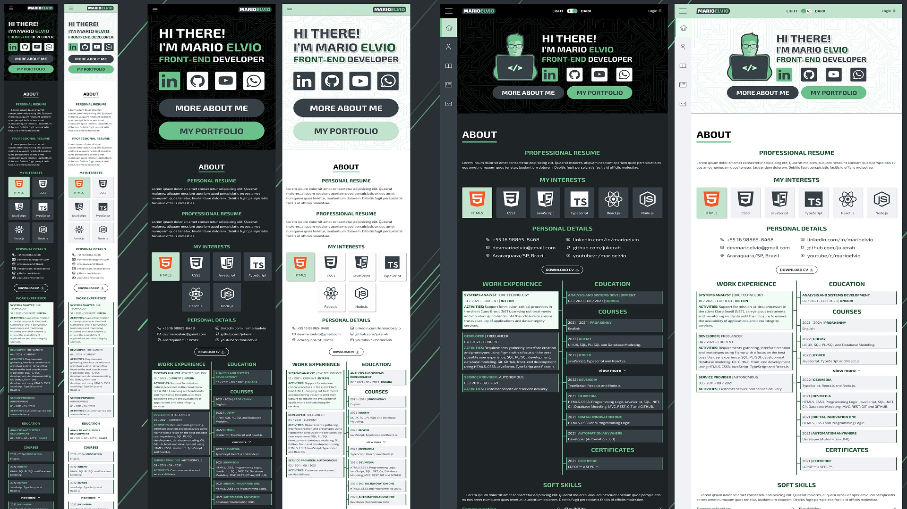
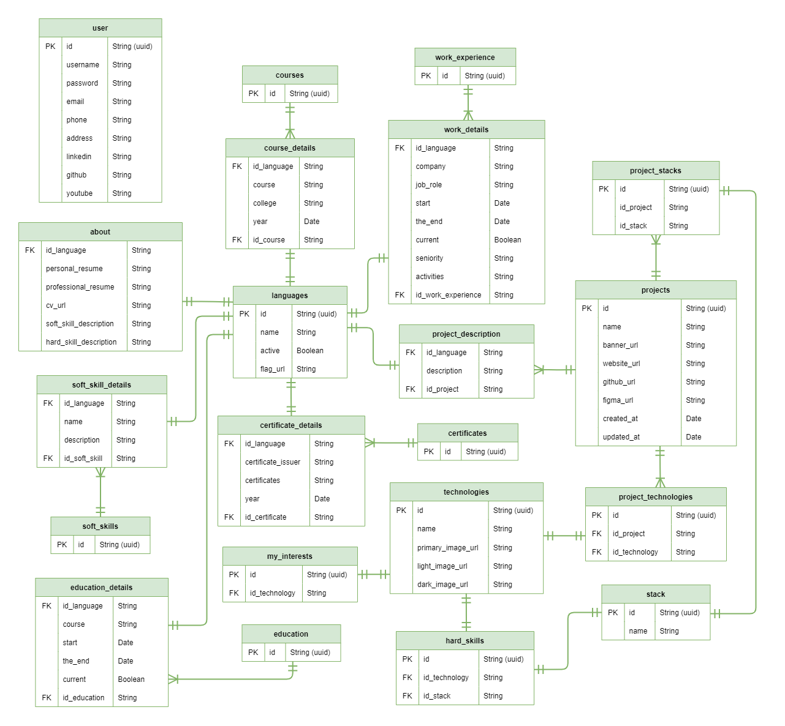

# Mario Elvio Portfólio

 

Sumário
=================
<!--ts-->
   * [Descrição do Projeto](#about)
   * [Deploy do Projeto](#demo-project)
   * [Features](#features)
   * [Pré-requisitos e instalação do projeto](#pre-req)
<!--te-->

<h2 id="about">Descrição do Projeto</h2>
 

> Este projeto é um site pessoal para falar sobre mim e publicar os projetos que desenvolvi ou trabalhei. As tecnologias utilizadas para o desenvolvimento deste site foram escolhidas de acordo com a necessidade do projeto de reutilização de código, fácil manutenção, legibilidade e todo o design foi pensado para mobile first.

 

### Design da interface com Figma:
### Link: <a align="left" href="https://www.figma.com/file/t85caWsRB2xisvnuplY9An/Mario-Elvio?node-id=0%3A1">https://www.figma.com/file/t85caWsRB2xisvnuplY9An/Mario-Elvio?node-id=0%3A1</a>

 

### Tecnologias e dependências utilizadas no projeto:
* <strong>Figma</strong> - Editor para criar o design da interface.
* <strong>PhotoShop</strong> - Software usado para edição de imagens.
* <strong>HTML5</strong> - Linguagem de marcação.
* <strong>React.js</strong> - Biblioteca para desenvolvimento front-end.
* <strong>TypeScript</strong> - Linguagem de programação usada no desenvolvimento.
* <strong>Styled Components</strong> - Biblioteca React usada para estilização.
* <strong>Node.js</strong> - Desenvolvimento no lado do servidor.
* <strong>MySQL</strong> - Banco de dados.

<h2 id="demo-project">Deploy do Projeto</h2>

 

### Deploy front-end:
> O deploy do front-end foi realizado na hostinger.

 

### Link: <a align="left" href="https://www.marioelvio.com/" target="_blank">https://www.marioelvio.com/</a>

 

### Deploy do back-end:
> Em breve.

 

### Deploy do banco de dados:
> Em breve.

<h2 id="features" align="center">Features</h2>

 

> Projeto ainda está em desenvolvimento e os próximos passos serão atualizados abaixo:

* [X] Requirements gathering.
* [X] Interface design.
* [X] Svgs adjustments.
### Front-end:
* [X] Project structure (folders, color palette, fonts and routes).
* [X] Header
* [X] Menu
* [X] Footer
* [X] Multi-language
* [X] Home page
* [X] About page
* [X] Portfolio page
* [X] Project page
* [X] Blog page
* [X] Contact page

### AdminPanel:
* [ ] Login page
* [ ] Settings page
* [ ] About page
* [ ] Resume page
* [ ] Personal details page
* [ ] My interests page
* [ ] Work Experience page
* [ ] Education page
* [ ] Certificates page
* [ ] Courses page
* [ ] Soft Skills page
* [ ] Hard Skills page
* [ ] Portfolio list page
* [ ] Edit portfolio page
* [ ] Technologies page

### Back-end:
> Em breve.

#### Database:
* [X] Database model

* [ ] Create database

<h2 id="pre-req">Pré-requisitos e instalação do projeto</h2>

### Public (Front-end):
#### Instalação:
#### `npm install`
#### Execução:
#### `npm start`

#### Build:
#### `npm run build`

 

### Server (Back-end):
> Em breve.

 

### Database:
> Em breve.

<h2 align="center">Autor</h2>

 

Desenvolvido por <a href="https://marioelvio.com">Mario Elvio</a>.

